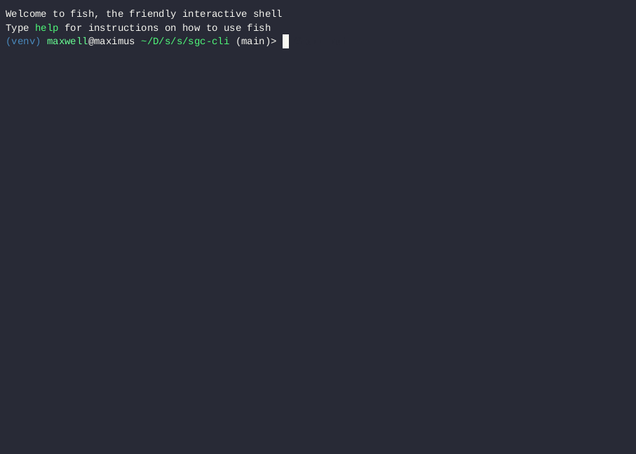

# SGC CLI
This is a command-line client for the Sub Gen Cluster. Like everything else in this convoluted collection of software I've been building, there's still a *ton* left to do, but here's a quick demo I put together:
